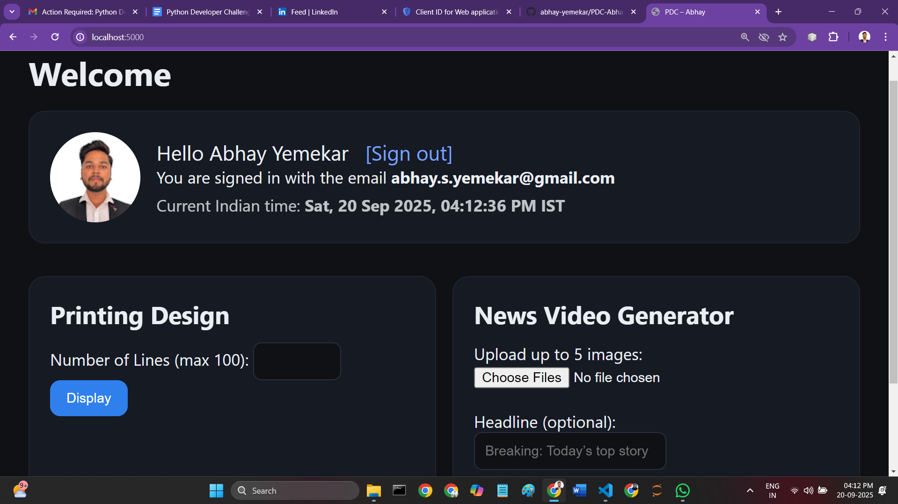

# PDC–Abhay • Python Developer Challenge


A clean, self‑contained Flask app that satisfies the FormulaQ Python Developer Challenge:

- **Google Sign‑In (OAuth 2.0)** → logs in, shows **name, email, profile photo, current IST**, and **Sign out**.
- **Printing Design** → diamond using `FORMULAQSOLUTIONS`, supporting **1–100** lines (even inputs normalized to odd).
- **News Video Generator** → upload up to **5 images** + optional **headline**, renders a news‑style **MP4** with banner and synthesized narration.

---

## Table of Contents
- [Live Demo (Local)](../../../c:/Users/DELL/Downloads/README_modern.md#live-demo-local)
- [0→100 Quickstart (VS Code)](../../../c:/Users/DELL/Downloads/README_modern.md#0100-quickstart-vs-code)
- [Google OAuth Setup](../../../c:/Users/DELL/Downloads/README_modern.md#google-oauth-setup)
- [Environment Variables](../../../c:/Users/DELL/Downloads/README_modern.md#environment-variables)
- [Project Structure](../../../c:/Users/DELL/Downloads/README_modern.md#project-structure)
- [Usage Walkthrough](../../../c:/Users/DELL/Downloads/README_modern.md#usage-walkthrough)
- [Screenshots to Capture](../../../c:/Users/DELL/Downloads/README_modern.md#screenshots-to-capture)
- [Troubleshooting](../../../c:/Users/DELL/Downloads/README_modern.md#troubleshooting)
- [How it Works (Architecture)](../../../c:/Users/DELL/Downloads/README_modern.md#how-it-works-architecture)
- [Contributing & Git](../../../c:/Users/DELL/Downloads/README_modern.md#contributing--git)

---

## Live Demo (Local)
```bash
python app.py   # then open http://localhost:5000
```

---

## 0→100 Quickstart (VS Code)

> Works on **Windows**, **macOS**, and **Linux**. Commands below show both variants where needed.

### 1) Clone or open the folder
```bash
# If zipped: unzip and open the folder in VS Code
# If using GitHub (recommended): clone your repo into a folder and open it in VS Code
```

### 2) Create & activate a virtual environment
**Windows (PowerShell)**
```powershell
python -m venv .venv
Set-ExecutionPolicy -Scope Process -ExecutionPolicy Bypass
.\.venv\Scripts\Activate.ps1
```

**macOS / Linux (bash/zsh)**
```bash
python3 -m venv .venv
source .venv/bin/activate
```

### 3) Install dependencies
```bash
pip install --upgrade pip
pip install -r requirements.txt
```

### 4) Configure secrets
Create a file named **`.env`** (copy from `.env.example`) and fill in values from your Google Cloud project:
```ini
FLASK_SECRET_KEY=<random-long-string>
GOOGLE_CLIENT_ID=<your-client-id>.apps.googleusercontent.com
GOOGLE_CLIENT_SECRET=<your-client-secret>
OAUTHLIB_INSECURE_TRANSPORT=1
```

### 5) Run
```bash
python app.py
# open http://localhost:5000
```

---

## Google OAuth Setup

1. **Create/select project** in Google Cloud Console.
2. **OAuth consent screen** → User type **External** → app name (e.g., PDC‑Abhay) → add your Gmail as **Test user**.
3. **Credentials → Create Credentials → OAuth client ID**  
   - Application type: **Web application**  
   - **Authorized JavaScript origins**:  
     - `http://localhost:5000`  
     - `http://127.0.0.1:5000`  
   - **Authorized redirect URIs**:  
     - `http://localhost:5000/auth/callback`  
     - `http://127.0.0.1:5000/auth/callback`
4. Copy the **Client ID** and **Client Secret** into `.env`.

---

## Environment Variables

| Name | Required | Example |
|------|----------|---------|
| `FLASK_SECRET_KEY` | Yes | `7c5090af3ee07f3c1b0...` |
| `GOOGLE_CLIENT_ID` | Yes | `8628...apps.googleusercontent.com` |
| `GOOGLE_CLIENT_SECRET` | Yes | `GOCSPX-...` |
| `OAUTHLIB_INSECURE_TRANSPORT` | Dev only | `1` |

> Tip: generate a secret quickly with `python -c "import secrets;print(secrets.token_hex(32))"`.

---

## Project Structure
```
PDC-Abhay/
├─ app.py                # Flask app + OAuth routes
├─ news_gen.py           # News video generator (Pillow + MoviePy + pyttsx3)
├─ pattern.py            # Printing Design logic
├─ requirements.txt
├─ .env.example
├─ templates/
│  ├─ base.html
│  ├─ index.html         # login screen
│  └─ logged_in.html     # post-login: IST + features
├─ static/
│  ├─ outputs/           # MP4 and temp audio
│  └─ sample_images/     # optional sample images
└─ uploads/              # user uploads (runtime)
```

---

## Usage Walkthrough

### A) Sign in with Google
- Click **Sign in with Google**.
- On success you’ll see: **Hello {Name}**, **email**, **profile photo**, **IST time**, and **Sign out**.

### B) Printing Design
1. Enter **Number of Lines** → e.g., **16** (or **21**).  
2. Click **Display**; a diamond will be rendered using the circular string `FORMULAQSOLUTIONS`.  
   - Inputs are clamped **1..100**.  
   - Even inputs are normalized to the next odd to keep symmetry.

### C) News Video Generator
1. Click **Choose Files** → select 2–5 images (`.png`, `.jpg`).  
2. Optional: type a headline (default: *Breaking: Today’s top story*).  
3. Click **Generate a news video**.  
   - Each image is styled with a bottom news banner and headline.
   - A short narration is generated and attached as audio.
   - Final MP4 is written to `static/outputs/news_video.mp4` and displayed on the page.

---

## Screenshots to Capture

> Create a folder `docs/screenshots/` and save the following (PNG recommended):

1. `01-login-page.png` – Landing page with **Sign in with Google** button.  
2. `02-logged-in.png` – Post-login card showing **name, email, photo, IST, Sign out**.  
3. `03-printing-16.png` – Printing Design with input **16** and output visible.  
4. `04-printing-21.png` – Printing Design with input **21** and output visible.  
5. `05-news-form.png` – News Video Generator form with images selected & headline filled.  
6. `06-news-result.png` – The **video player** after generation (first frame visible).  
7. *(Optional)* `07-github-repo.png` – Your GitHub repo page.  
8. *(Optional)* `08-commit-history.png` – Commit history with clear messages.

Embed them here (example):
```md

```

---

## Troubleshooting

- **PowerShell activation blocked**  
  ```powershell
  Set-ExecutionPolicy -Scope Process -ExecutionPolicy Bypass
  .\.venv\Scripts\Activate.ps1
  ```
- **Google 400 (client_id=None)** → `.env` not loaded or incorrect. Ensure `load_dotenv()` is called and you run `python app.py` from the project root.
- **jwks_uri missing** → ensure `server_metadata_url="https://accounts.google.com/.well-known/openid-configuration"` is used in `oauth.register`.
- **Windows file lock on narration.wav** → this repo closes audio/video handles and deletes the temp WAV after encoding (see `news_gen.py`). If needed, set narration to `None`.
- **MoviePy/ffmpeg**  
  - Windows: `winget install Gyan.FFmpeg` (or `choco install ffmpeg`)  
  - macOS: `brew install ffmpeg`

---

## How it Works (Architecture)

- **Flask + Authlib** handle the OAuth flow. By pointing to Google’s OpenID discovery doc, tokens and JWKS are validated automatically.
- **Printing Design** builds a symmetric diamond width sequence (1→…→max→…→1), taking characters from a circular base string `FORMULAQSOLUTIONS` with a shifting start offset per row.
- **News Video**:
  - `Pillow` draws a lower-third banner + headline over each image.
  - `pyttsx3` generates a short narration (`.wav`).
  - `MoviePy` concatenates slides and muxes narration into an **MP4**.
- **Templates** provide a dark, minimal UI; features appear only after login.

---

## Contributing & Git

**.gitignore** (do not commit secrets or build artifacts):
```
.venv/
__pycache__/
*.pyc
.env
static/outputs/*.mp4
static/outputs/_tmp_audio/
uploads/
.DS_Store
.vscode/
```

**Typical workflow**
```bash
# first time
git init
git add .
git commit -m "feat: initial Flask app with OAuth, pattern, video generator"
git branch -M main
git remote add origin https://github.com/<your-username>/PDC-Abhay.git
git push -u origin main

# subsequent changes
git add -A
git commit -m "fix: handle Windows file-lock in narration"
git push
```

> Use small, clear commits. Keep secrets in `.env` (never commit it).

---

**Author:** Abhay • For the FormulaQ Python Developer Challenge.